# GolaCSS

Unity 게임 메뉴 UI를 웹에서 그대로 쓰는 키트. 빌드 없음, 의존성 없음.

```html
<link rel="stylesheet" href="gola.css">
<script src="gola.js"></script>
```

클래스 없이 쓰고 싶으면 한 줄 더. 그냥 태그가 게임 모양으로 바뀝니다.

```html
<link rel="stylesheet" href="gola-classless.css">
```

기본 켜짐이에요. `body`에 `gola-auto`가 자동으로 붙고, 빼려면 `<body data-gola-off>`. 직접 단 `.gola-*`가 항상 이겨요. 라벨은 `<label>`로 감싸면 한 줄 행 (토글행 30px, 일반 24px).

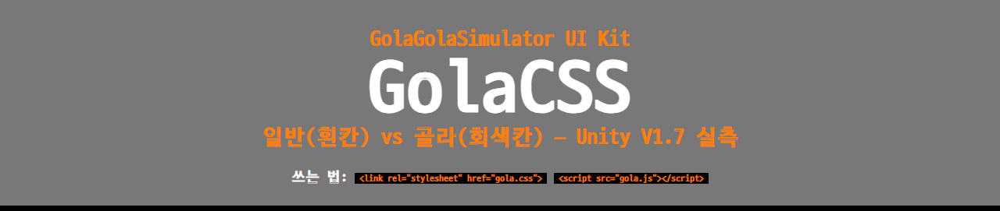

## 갤러리

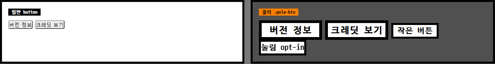

```html
<button class="gola-btn">버전 정보</button>
<button class="gola-btn gola-btn--sm">작은 버튼</button>
<button class="gola-restart">재시작</button>
```

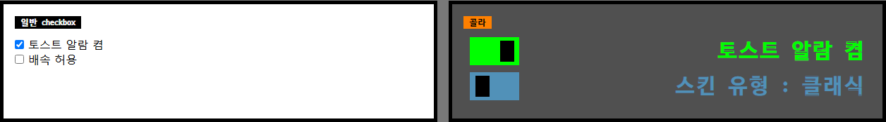

```html
<input type="checkbox" class="gola-check" id="g1" checked aria-label="토스트 알람">
<label class="gola-switch" for="g1"><span class="gola-knob"></span></label>
<span class="gola-label" data-gola-text="켬|끔" data-gola-for="g1">켬</span>
```

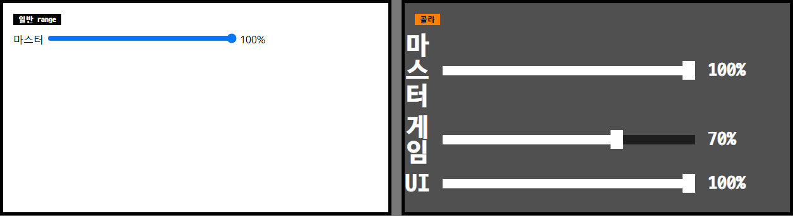

```html
<div data-gola-vol>
<input type="range" class="gola-slider" data-ch="vol" data-label="gdM" min="0" max="100" step="1" value="100" aria-label="마스터 볼륨">
<span class="gola-vol-val" id="gdM">100%</span>
</div>
```

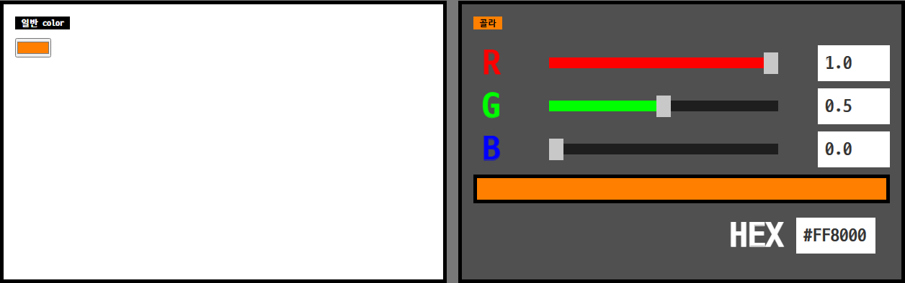

```html
<div data-gola-rgb>
  <input type="range" class="gola-slider" data-ch="r" min="0" max="1" step="0.0001" value="1" aria-label="R 값">
  <input type="range" class="gola-slider" data-ch="g" min="0" max="1" step="0.0001" value="0.5" aria-label="G 값">
  <input type="range" class="gola-slider" data-ch="b" min="0" max="1" step="0.0001" value="0" aria-label="B 값">
  <input type="text" class="gola-value" value="1.0" maxlength="6" aria-label="R 값">
  <input type="text" class="gola-value" value="0.5" maxlength="6" aria-label="G 값">
  <input type="text" class="gola-value" value="0" maxlength="6" aria-label="B 값">
  <input type="text" class="gola-hex wide" value="#FF8000" maxlength="9" aria-label="HEX 색상">
  <div class="gola-color-preview"></div>
</div>
```

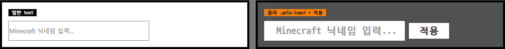

```html
<input type="text" class="gola-input" maxlength="16" placeholder="Minecraft 닉네임 입력...">
<button class="gola-btn gola-btn--apply">적용</button>
```

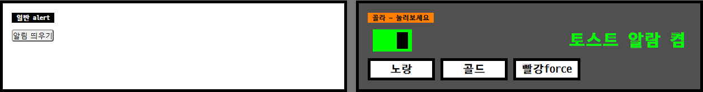

```html
<button data-gola-toast-text="스킨을 불러왔습니다." data-gola-toast-color="gola-toast--gold">골드</button>
```

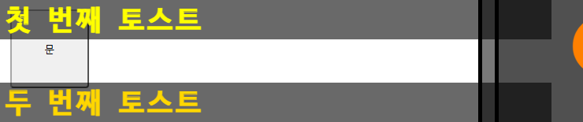

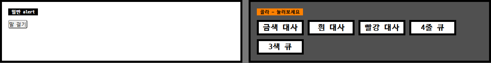

```html
<button data-gola-say-text="여기가 백도어다." data-gola-say-color="#FFD700">말 걸기</button>
```

한 줄씩 표시, 새 호출이 바로 덮어씀. 이어갈 땐 배열 큐 한 번으로: `golaSay([{text:"첫 줄",hold:2000},{text:"둘째 줄",hold:2000}])` (hold "Infinity" 잔류, 50ms/자). 자세히는 `guide.html` -대사- 참고.

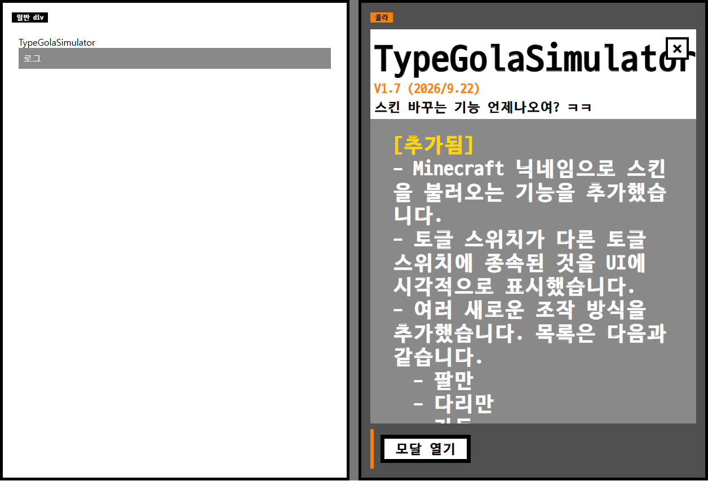

```html
<button data-gola-modal-open="#gdModal">버전 정보 열기</button>
<div class="gola-modal" id="gdModal">
  <div class="gola-modal-head">
    <div class="gola-modal-title">TypeGolaSimulator</div>
    <div class="gola-modal-ver">V1.7 (2026/9.22)</div>
    <button class="gola-modal-btn close" data-gola-modal-close="#gdModal">×</button>
  </div>
  <div class="gola-modal-log">...</div>
</div>
```

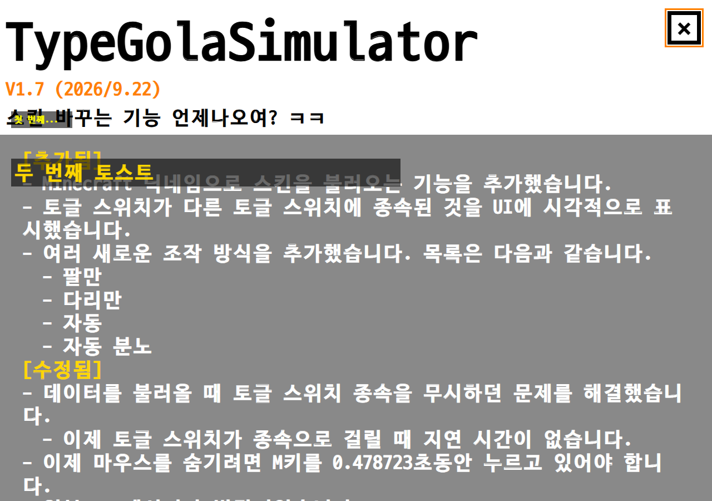

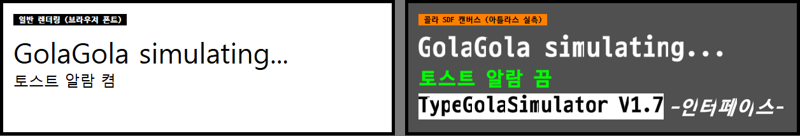

```html
<canvas class="gola-sdfcv" data-text="GolaGola" data-size="40" data-color="#fff"></canvas>
```

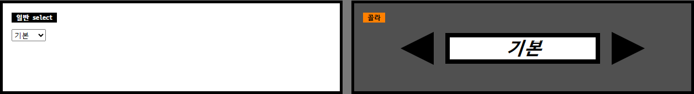
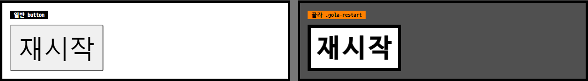
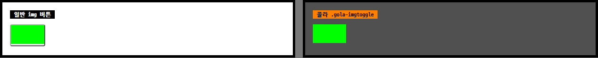
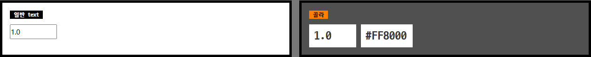
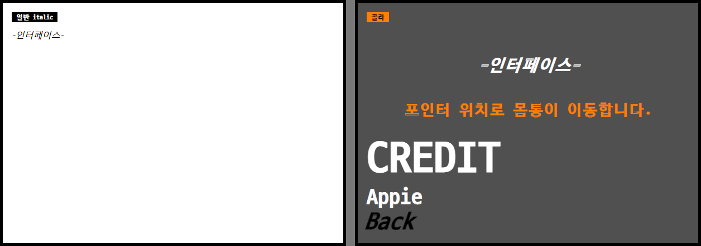
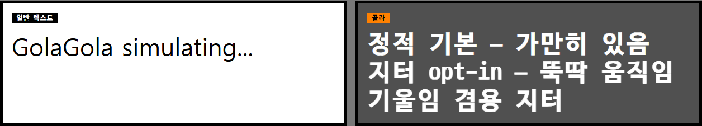
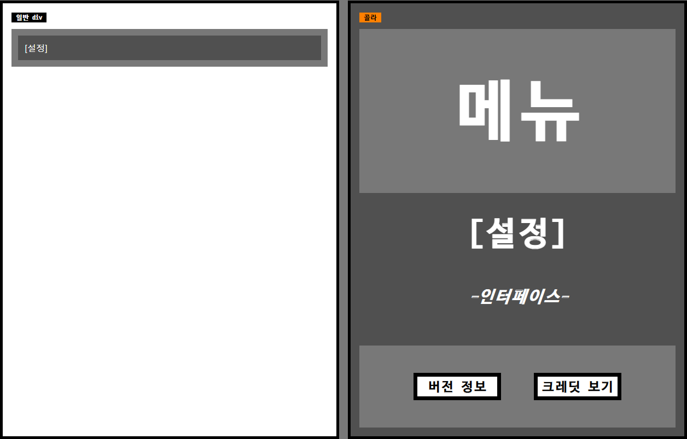
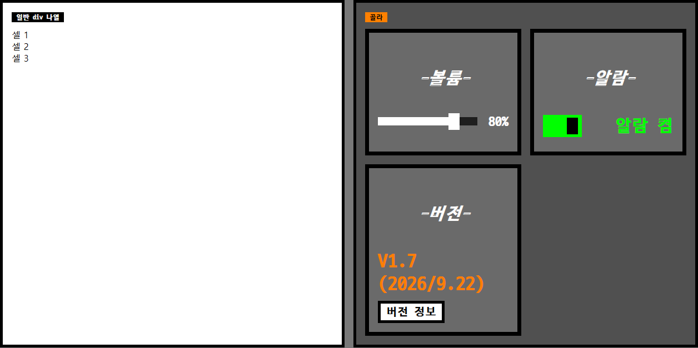

```html
<div class="gola-grid"><div class="gola-card">셀</div></div>
```

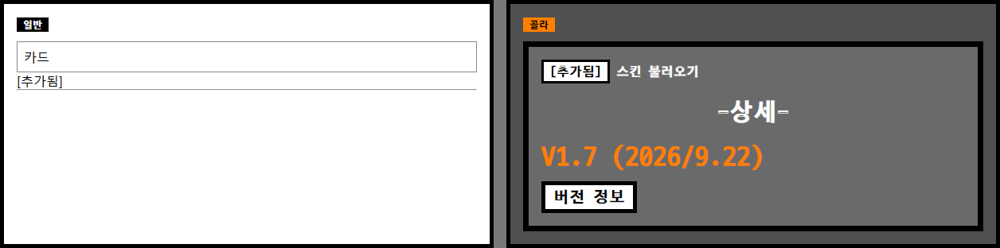

```html
<select class="gola-select" aria-label="스킨 유형"><option>클래식</option><option>슬림</option></select>
<textarea class="gola-textarea" rows="2" placeholder="메모" aria-label="메모"></textarea>
<label><input type="radio" class="gola-radio" name="q" checked> 예</label>
```

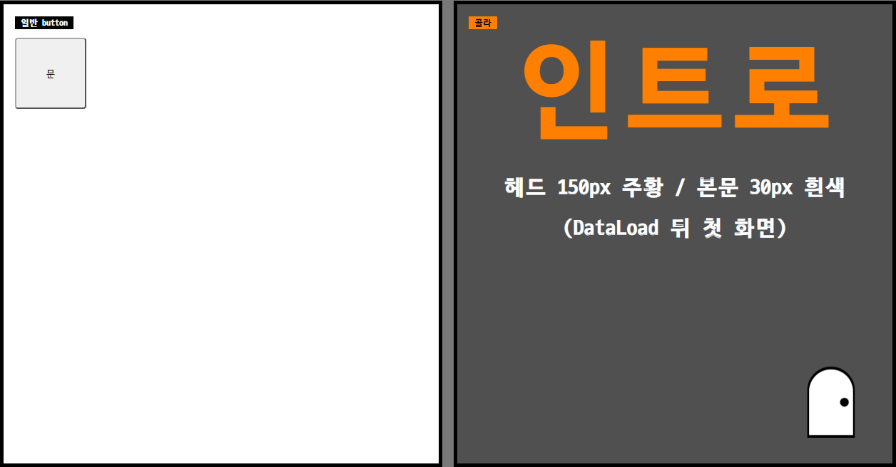

```html
<button class="gola-door" style="background-image:url('./assets/that-door.png')"></button>
```

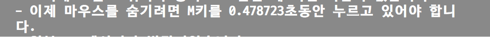

## 파일

| 파일 | 설명 |
|---|---|
| `gola.css` | 본체 |
| `gola.js` | 배선 (없어도 토글·드래그는 동작) |
| `gola-classless.css` | 클래스 없이 쓰는 확장 |
| `gola-sdf.js` | SDF 캔버스 렌더러 + `assets/sdf/` |
| `index.html` | 개발용 대조실 |
| `guide.html` | 사용 설명서 |
| `demo-classless.html` | 클래스리스 미니 메뉴 |

## 개발용 (수치·결정 기록)

Unity GolaGolaSimulator V1.7(f3535eb) 실측 기준.

### 수치

- 버튼 160x50 흰면 검정테7 24px, 전수 Transition None (재시작만 200x100 55px + ColorTint hover)
- 모달 ×◀▶ 60x60 50px (×만 Bold), 풀스크린 흰 + 로그 #898989 36px
- 토글 70x40, knob 20x30 (7.5px↔42.5px, 0.15s), 라벨 30px (색만 0.2s 트윈)
- 슬라이더 트랙 400x15 #1E1E1E, 핸들 20x30 #C8C8C8 (볼륨만 흰색), 스냅 없음
- 스위치박스 280x56 (원본 350x70의 0.8, TypeGola 계승), 화살표 70x70
- 볼륨 min0 max100 step1 + CeilToInt 표기 (soundStep 0.05는 소리 재생 게이트)
- 입력 100x50 (HEX 110, 닉네임 350) 흰바탕 #323232 25px, HEX 3/4/6/8 + 무효 복원
- 토스트 700x50 36px, 표시 3.5초, 최대 3개, 스택 +55/+35
- 패널 #787878 / 내용 #505050, 페이드 0.2s
- 서체 D2Coding 단일 (SDF가 Bold 소스 베이크 → Bold TTF를 400으로 로드)
- 이탤릭 금지, skewX(-19.29deg)만 (TMP italicStyle 35)
- 대사: 50ms/자, hold 기본 2200 ("Infinity" 잔류), firstWait 기본 0, 클릭=즉시완성·다음 화면. 파트별 색·슬롯 격자·사운드 훅 지원
- 클래스리스 body 자동 gola-auto (`data-gola-off`로 해제), 그리드 flex 1칸

### 의도적 결정

- 토스트 진입·퇴장은 X축만 (Y가 섞이면 반투명이 겹쳐 보임)
- 버튼 `:active` scale 없음, 포커스 링은 주황 3px 유지 (`.gola-no-ring`으로 끄기)
- HEX 8자리는 표시 유지, 파싱은 앞 6자리
- `select`·`textarea`·`radio`는 게임 문법으로 새로 만든 확장
- 타이쿤 스킨·목도리/Galmuri는 제외
- SDF: 등배 찍고 임계(0.46) → 알파만 축소, 출력보다 항상 크게. 아틀라스 703글리프 전수 감사済 (`tools/peaks.txt`, `tools/sweep.py` 8424체크 PASS)
